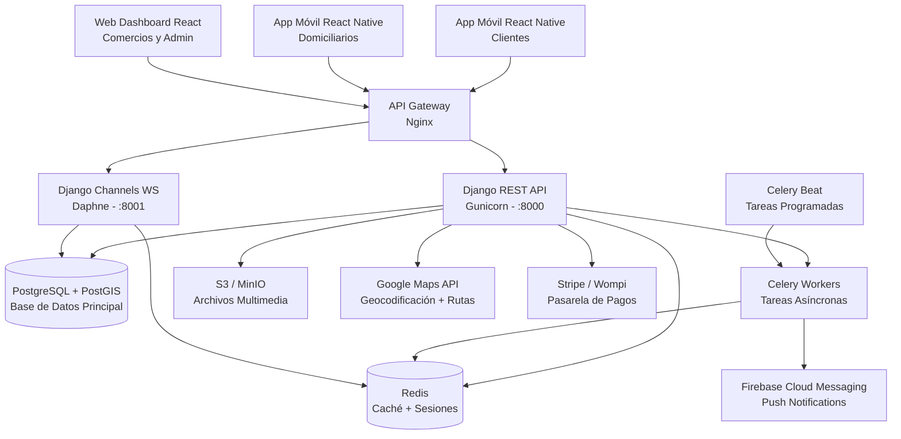
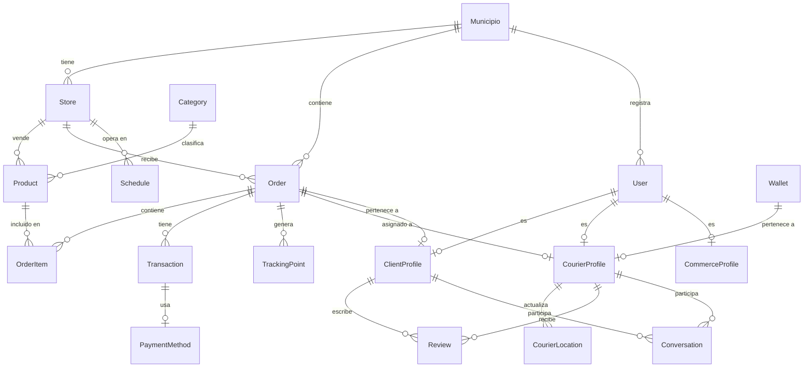
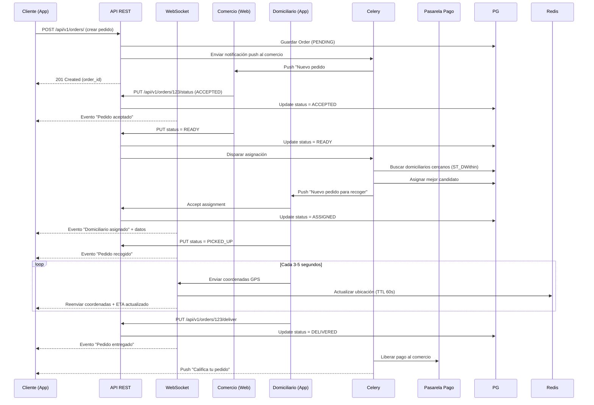

# KINETIK - Plataforma de Domicilios
## Documento de Arquitectura y Diseño Técnico

---

## 1. Visión General de la Arquitectura

Kinetik es una plataforma de domicilios construida con **Django + React Native (Expo)**, diseñada bajo una **Arquitectura Hexagonal (Puertos y Adaptadores)** con aplicaciones Django desacopladas, preparada para escalar desde un municipio hasta múltiples ciudades.

La arquitectura sigue el principio **single-tenant preparado para multi-tenant**: los modelos clave incluyen `municipio_id` desde el Día 1 para facilitar la migración futura a `django-pgschemas` (schema-per-tenant).

---

## 2. Diagrama de Arquitectura de Alto Nivel



### Separación de Procesos

| Proceso | Puerto | Propósito | Workers |
| :--- | :--- | :--- | :--- |
| **Gunicorn** | 8000 | API REST HTTP (DRF) | 4 workers |
| **Daphne** | 8001 | WebSockets (tracking, chat) | 2 workers |
| **Celery** | - | Tareas asíncronas (notificaciones, pagos) | 4 workers |
| **Celery Beat** | - | Cron scheduler (asignación, reportes) | 1 worker |

---

## 3. Stack Tecnológico Detallado

### 3.1 Backend

| Componente | Tecnología | Versión | Propósito |
| :--- | :--- | :--- | :--- |
| Framework | Django | 5.x | Web framework principal |
| API REST | Django REST Framework | 3.15+ | Exposición de endpoints REST |
| WebSockets | Django Channels + Daphne | 4.x | Comunicación en tiempo real |
| Base de Datos | PostgreSQL + PostGIS | 15 | Datos transaccionales + geográficos |
| Caché / Colas | Redis | 7 | Caché, sesiones, broker Celery |
| Tareas Asíncronas | Celery | 5.x | Procesamiento en segundo plano |
| Autenticación | SimpleJWT | 5.x | JWT con refresh tokens |
| Documentación API | drf-spectacular | - | OpenAPI 3.0 + Swagger UI |

### 3.2 Frontend Móvil

| Componente | Tecnología | Propósito |
| :--- | :--- | :--- |
| Framework | React Native (Expo) | App nativa iOS + Android |
| Mapas | react-native-maps | Visualización de mapa y tracking |
| Estado Global | Zustand | Gestión de estado liviana |
| Offline | WatermelonDB | Base de datos local con sincronización |
| Persistencia | redux-persist | Persistencia de carrito y sesión |
| Navegación | React Navigation | Rutas y pantallas |
| HTTP | Axios | Cliente HTTP para API |

### 3.3 Frontend Web

| Componente | Tecnología | Propósito |
| :--- | :--- | :--- |
| Framework | React (Vite) | Dashboard web rápido |
| Estilos | Tailwind CSS | UI utility-first |
| Estado | Zustand | Estado global |
| Mapas | Leaflet + react-leaflet | Mapas en web |

### 3.4 Infraestructura

| Componente | Tecnología | Propósito |
| :--- | :--- | :--- |
| Contenedores | Docker | Empaquetado de servicios |
| Orquestación | Docker Compose -> EKS | MVP: Docker Compose. Escala: K8s. |
| Proxy Inverso | Nginx | Reverse proxy, SSL, rate limiting |
| Monitoreo | Sentry + Prometheus + Grafana | Errores + métricas |
| Almacenamiento | S3 (o MinIO local) | Imágenes de productos, avatares |
| CDN | CloudFront | Distribución de assets estáticos |

---

## 4. Estructura del Proyecto

```
/kinetik
  /backend                    # Django project
    /core                     # Configuración central
      settings/
        __init__.py
        base.py               # Settings compartidos (DB, Redis, Celery, JWT, CORS, Channels)
        dev.py                # Debug=True, consola email, CORS abierto
        production.py         # SSL, HSTS, S3, Sentry
        test.py               # SQLite :memory:, mock GDAL, channels in-memory
      __init__.py
      asgi.py                 # ProtocolTypeRouter(HTTP + WebSocket)
      celery.py               # Celery app + autodiscover_tasks
      routing.py              # WebSocket routing (TrackingConsumer, ChatConsumer, NotificationConsumer)
      urls.py                 # Router raíz: /api/v1/{auth,stores,...}, /admin/, /api/docs/, /health/
      wsgi.py                 # WSGI entry point
    /apps                     # Aplicaciones Django (13 apps)
      /municipios             # Catálogo de municipios (read-only público)
      /users                  # Auth, registro, perfiles (cliente/comercio/domiciliario)
      /stores                 # Tiendas, categorías, horarios, direcciones de entrega
      /products               # Productos por tienda con opciones configurables
      /orders                 # Órdenes con máquina de 8 estados
      /payments               # Métodos de pago, transacciones, wallet domiciliarios
      /couriers               # Asignación inteligente (scoring), disponibilidad
      /tracking               # GPS en tiempo real (WebSocket + persistencia)
      /notifications          # Notificaciones push e in-app (WebSocket)
      /chat                   # Conversaciones por pedido (WebSocket)
      /reviews                # Calificaciones y disputas
      /analytics              # Dashboard admin + reportes diarios (Celery)
      /tasks                  # Tareas asíncronas Celery (sin modelos/vistas)
    /shared                   # Código compartido
      exceptions/
        handlers.py           # Manejador global de errores DRF
      permissions/            # (reservado)
      filters/                # (reservado)
      mixins/                 # (reservado)
      pagination.py           # StandardPagination (page_size=20)
    /templates
    /static
    conftest.py               # Fixtures compartidos de pytest
    manage.py                 # Django management CLI
    pytest.ini                # Configuración de pytest
    pytest_gis_patch.py       # Mock de PostGIS para tests sin GDAL
    .pytest_cache/
    requirements/
      base.txt
      dev.txt
      production.txt

  /mobile                     # React Native (Expo) — frontend móvil
    /src
      /modules
        /auth
        /catalog
        /cart
        /orders
        /tracking
        /payments
        /profile
      /shared
        /components
        /hooks
        /services
        /stores
        /offline
      App.tsx

  /web                        # React + Vite (Dashboard) — frontend web
    /src
      /components
      /pages
      /hooks
      /services
      /stores

  /docker                     # Docker config
    dev/
      docker-compose.yml
      Dockerfile
      nginx.conf
      .env.example

  /scripts                    # Scripts de automatización
    setup.sh
    deploy.sh
    seed_data.py

  arquitectura.md             # Este documento
  funcionalidad.md            # Documentación funcional
  planificacion.txt           # Planificación del proyecto
  README.md                   # README del proyecto
```

---

### 4.1 Estructura Detallada por Módulo

Cada app sigue la misma convención de nomenclatura para localizar archivos rápidamente.

##### Convención de Archivos por App

| Archivo | Propósito |
| :--- | :--- |
| `models.py` | Definición de modelos (ORM) |
| `serializers.py` | Serializadores DRF (validación + transformación) |
| `views.py` | Vistas / ViewSets (lógica de endpoints) |
| `urls.py` | Enrutamiento de endpoints |
| `services.py` | Lógica de negocio compleja (solo couriers) |
| `consumers.py` | WebSocket consumers (solo tracking, chat, notifications) |
| `admin.py` | Configuración del panel admin de Django |
| `tests/` | Tests de la app |

---

#### `users` — Autenticación y perfiles

```
apps/users/
├── models.py          # User(AbstractUser), ClientProfile, CourierProfile, CommerceProfile
├── serializers.py     # UserSerializer, RegisterSerializer, ClientProfileSerializer,
│                      # CourierProfileSerializer, CommerceProfileSerializer
├── views.py           # RegisterView(CreateAPIView), UserViewSet(ReadOnlyModelViewSet) → me()
├── urls.py            # /auth/login/ (TokenObtainPair), /auth/refresh/ (TokenRefresh),
│                      # /auth/register/ (RegisterView), /auth/me/ (UserViewSet)
├── admin.py
└── tests/
    └── test_auth.py   # TestRegister (6 tests), TestLogin (3 tests), TestProfile (4 tests)
```

**Endpoints:** `POST /auth/register/`, `POST /auth/login/`, `POST /auth/refresh/`, `GET|PATCH /auth/me/`

---

#### `municipios` — Catálogo de municipios

```
apps/municipios/
├── models.py          # Municipio (codigo_dane, nombre, centro_lat/lng, radio_km, activo)
├── serializers.py     # MunicipioSerializer
├── views.py           # MunicipioViewSet(ReadOnlyModelViewSet) → solo activo=True
├── urls.py            # /municipios/ (router)
├── admin.py
└── tests/
    └── test_municipios.py  # TestMunicipioList (2 tests)
```

**Endpoints:** `GET /municipios/`

---

#### `stores` — Tiendas, categorías y direcciones

```
apps/stores/
├── models.py          # StoreCategory, Store(PointField), Schedule, Address(PointField)
├── serializers.py     # StoreSerializer, StoreDetailSerializer, AddressSerializer
├── views.py           # StoreViewSet(ReadOnlyModelViewSet) → nearby(), AddressViewSet(ModelViewSet)
├── urls.py            # /stores/ (StoreViewSet), /stores/addresses/ (AddressViewSet)
└── admin.py
```

**Endpoints:** `GET /stores/`, `GET /stores/{id}/`, `GET /stores/nearby/?lat=&lng=&radius=`, `GET|POST /stores/addresses/`

---

#### `products` — Productos por tienda

```
apps/products/
├── models.py          # ProductCategory, Product, ProductOption(JSON), InventoryLog
├── serializers.py     # ProductCategorySerializer, ProductSerializer, ProductDetailSerializer
├── views.py           # ProductViewSet(ReadOnlyModelViewSet) → filter by ?store=, solo is_available
├── urls.py            # /products/ (router)
└── admin.py
```

**Endpoints:** `GET /products/?store=`

---

#### `orders` — Ciclo de vida de pedidos

```
apps/orders/
├── models.py          # Order(8 estados), OrderItem, OrderStatusLog
├── serializers.py     # OrderSerializer, OrderCreateSerializer, OrderStatusSerializer
├── views.py           # OrderViewSet(ModelViewSet) → status(), active()
├── urls.py            # /orders/ (router)
└── admin.py
```

**Endpoints:** `GET|POST /orders/`, `GET|PATCH /orders/{id}/`, `POST /orders/{id}/status/`, `GET /orders/active/`

**Queryset por rol:** CLIENTE → `client=user`, COMERCIO → `store__commerceprofile__user`, DOMICILIARIO → `courier=user`

---

#### `payments` — Métodos de pago, transacciones y wallet

```
apps/payments/
├── models.py          # PaymentMethod, Transaction, Wallet
├── serializers.py     # PaymentMethodSerializer, TransactionSerializer, PaymentIntentSerializer
├── views.py           # PaymentMethodViewSet(ModelViewSet), TransactionViewSet(ReadOnly),
│                      # PaymentViewSet(ViewSet) → intent(), webhook()
├── urls.py            # /payments/methods/, /payments/transactions/, /payments/intent/,
│                      # /payments/webhook/
└── admin.py
```

**Endpoints:** `GET|POST /payments/methods/`, `GET /payments/transactions/`, `POST /payments/intent/`, `POST /payments/webhook/`

---

#### `couriers` — Disponibilidad, asignación y ubicación

```
apps/couriers/
├── models.py          # CourierLocation(PointField), CourierStatus, AssignmentLog
├── views.py           # CourierViewSet(ViewSet) → toggle_availability(), accept_order(), reject_order()
├── urls.py            # /couriers/ (router)
├── services.py        # AssignmentService → batch_assign_pending_orders(), _find_best_courier() (scoring)
└── admin.py
```

**Endpoints:** `POST /couriers/toggle_availability/`, `POST /couriers/accept_order/`, `POST /couriers/reject_order/`

**Lógica clave:** `AssignmentService` asigna pedidos con scoring ponderado (distancia 40%, rating 20%, carga 20%, tiempo inactivo 10%, tasa completados 10%)

---

#### `tracking` — GPS en tiempo real

```
apps/tracking/
├── models.py          # TrackingPoint(PointField), Route(polyline)
├── serializers.py     # TrackingPointSerializer
├── views.py           # TrackingViewSet(ReadOnlyModelViewSet) → order_history/?order_id=
├── urls.py            # /tracking/ (router)
├── consumers.py       # TrackingConsumer → ws/tracking/<order_id>/ (update_location + broadcast)
└── admin.py
```

**Endpoints:** `GET /tracking/order_history/?order_id=`
**WebSocket:** `ws:///tracking/<order_id>/`

---

#### `notifications` — Notificaciones push e in-app

```
apps/notifications/
├── models.py          # PushToken, Notification(tipos: ORDER_UPDATE, ASSIGNMENT, PROMO, SYSTEM)
├── serializers.py     # NotificationSerializer, MarkReadSerializer
├── views.py           # NotificationViewSet(ReadOnlyModelViewSet) → mark_read(), unread_count()
├── urls.py            # /notifications/ (router)
├── consumers.py       # NotificationConsumer → ws/notifications/ (grupo personal por user)
└── admin.py
```

**Endpoints:** `GET /notifications/`, `POST /notifications/mark_read/`, `GET /notifications/unread_count/`
**WebSocket:** `ws:///notifications/`

---

#### `chat` — Conversaciones por pedido

```
apps/chat/
├── models.py          # Conversation(OneToOne→Order, M2M participants), Message
├── serializers.py     # ConversationSerializer, MessageSerializer
├── views.py           # ConversationViewSet(ReadOnlyModelViewSet) → messages()
├── urls.py            # /chat/conversations/ (router)
└── consumers.py       # ChatConsumer → ws/chat/<conversation_id>/ (solo participantes)
```

**Endpoints:** `GET /chat/conversations/`, `GET /chat/conversations/{id}/messages/`
**WebSocket:** `ws:///chat/<conversation_id>/`

---

#### `reviews` — Calificaciones y disputas

```
apps/reviews/
├── models.py          # Review(OneToOne→Order, store_rating, courier_rating), Dispute
├── serializers.py     # ReviewSerializer, DisputeSerializer
├── views.py           # ReviewViewSet(ModelViewSet), DisputeViewSet(ModelViewSet)
├── urls.py            # /reviews/ (router), /reviews/disputes/ (router)
└── admin.py
```

**Endpoints:** `GET|POST /reviews/`, `GET|POST /reviews/disputes/`

---

#### `analytics` — Dashboard y estadísticas (solo admin)

```
apps/analytics/
├── models.py          # DailySalesReport, CourierPerformance, MunicipioStats
├── serializers.py     # DashboardSerializer
├── views.py           # AnalyticsViewSet(ViewSet) → dashboard()
├── urls.py            # /analytics/ (router)
└── admin.py
```

**Endpoints:** `GET /analytics/dashboard/` (IsAdminUser)

---

#### `tasks` — Tareas Celery asíncronas

```
apps/tasks/
├── celery_tasks.py    # dispatch_order_assignment, batch_assign_orders, send_push_notification,
│                      # cleanup_expired_sessions, generate_daily_reports, courier_heartbeat_check
└── apps.py            # Configuración de la app
```

**Schedule (Celery Beat):** `batch_assign_orders` cada 5s, `courier_heartbeat_check` cada 60s, `cleanup_expired_sessions` cada 1h, `generate_daily_reports` cada 12h

---

#### Core — Configuración central

```
core/
├── settings/
│   ├── base.py        # Settings compartidos (DB, Redis, Celery, JWT, CORS, Channels)
│   ├── dev.py         # Debug=True, consola email, CORS abierto
│   ├── production.py  # SSL, HSTS, S3, Sentry
│   └── test.py        # SQLite :memory:, mock GDAL, channels in-memory
├── urls.py            # Router raíz: /api/v1/{auth,stores,products,orders,payments,
│                      #   couriers,tracking,notifications,chat,reviews,analytics,municipios}
│                      # /admin/, /api/schema/, /api/docs/, /health/
├── asgi.py            # ProtocolTypeRouter(HTTP + WebSocket)
├── wsgi.py            # WSGI entry point
├── celery.py          # Celery app + autodiscover_tasks
└── routing.py         # WebSocket routing: TrackingConsumer, ChatConsumer, NotificationConsumer
```

#### Shared — Componentes reutilizables

```
shared/
├── pagination.py          # StandardPagination(PageNumberPagination, page_size=20)
├── exceptions/
│   └── handlers.py        # custom_exception_handler() → errores consistentes DRF
├── permissions/           # (reservado para permisos personalizados)
├── filters/               # (reservado para filtros personalizados)
└── mixins/                # (reservado para mixins personalizados)
```

---

## 5. Modelo de Datos (Diagrama Entidad-Relación)



### Descripción de Modelos Principales

**Municipio**: Almacena las ciudades donde opera la plataforma. Contiene coordenadas del centro urbano y radio de cobertura. Clave para futura expansión multi-tenant.

**User**: Modelo de usuario extendido de Django `AbstractUser`. Incluye `phone`, `municipio` (FK), `user_type` (cliente/comercio/domiciliario/admin).

**Store**: Comercios afiliados. Incluye nombre, logo, categoría, dirección, coordenadas, horarios, estado (activo/inactivo), plan de suscripción.

**Product**: Productos de cada tienda. Incluye nombre, descripción, precio, foto, categoría, opciones (tamaños, extras), stock.

**Order**: Pedido con máquina de estados: `PENDING -> ACCEPTED -> PREPARING -> READY -> ASSIGNED -> PICKED_UP -> DELIVERED / CANCELLED`. Incluye ubicación de entrega, notas, subtotal, tarifa domicilio, total.

**CourierProfile**: Perfil extendido del domiciliario. Incluye `is_available`, `current_order_count`, `avg_rating`, `completion_rate`, `idle_minutes`, `last_location` (PointField con índice GIST).

**Transaction**: Registro de pago. Incluye monto, método, estado (pending/completed/refunded), ID de transacción de la pasarela.

**CourierLocation**: Historial de ubicaciones GPS del domiciliario. PointField con índice espacial GIST.

---

## 6. Flujo de Datos: Pedido Completo



---

## 7. Algoritmo de Asignación (Diseño Detallado)

### 7.1 Ejecución

```
Cada 5 segundos (Celery Beat):

1. Consultar pedidos en estado READY (máximo 20 por lote)
2. Para cada pedido:
   a. Buscar couriers disponibles con ST_DWithin (radio 5km)
   b. Calcular score compuesto (0-100):
      - Distancia (peso 40%): 1 - (distancia / radio_max)
      - Calificación (peso 20%): rating / 5 * 20
      - Carga (peso 20%): (2 - pedidos_actuales) * 10
      - Tiempo esperando (peso 10%): min(minutos_inactivo / 10, 10)
      - Tasa completados (peso 10%): tasa_completados * 10
   c. Seleccionar mejor puntaje
   d. Asignar con bloqueo atómico (UPDATE WHERE status=READY)
   e. Publicar evento en Redis para WebSockets
3. Pedidos no asignados después de 30s -> reintentar con radio 8km
```

### 7.2 Consulta PostGIS

```sql
-- Filtrado espacial eficiente con índice GIST
SELECT cp.*, ST_Distance(cp.last_location, ST_SetSRID(ST_MakePoint(%lng%, %lat%), 4326)) as distance
FROM couriers_courierprofile cp
WHERE cp.is_available = true
  AND cp.current_order_count < 2
  AND ST_DWithin(
      cp.last_location,
      ST_SetSRID(ST_MakePoint(%lng%, %lat%), 4326),
      5000  -- 5km en metros
  )
ORDER BY distance ASC;
```

### 7.3 Optimización Futura: H3

Cuando se superen 500 couriers concurrentes, reemplazar ST_DWithin por H3 (Uber):

```python
import h3

def assign_with_h3(order_lat, order_lng):
    hex_center = h3.geo_to_h3(order_lat, order_lng, resolution=9)
    hex_neighbors = h3.k_ring(hex_center, k=3)
    # Redis contiene sets de couriers por celda H3
    nearby_ids = set()
    for h in hex_neighbors:
        nearby_ids |= redis.smembers(f"h3:{h}")
    # Procesar solo estos couriers
```

---

## 8. Pipeline de Geolocalización (Tiempo Real)

### 8.1 Componentes

| Componente | Tecnología | Función |
| :--- | :--- | :--- |
| **Ingesta GPS** | Django Channels WebSocket | Recibir coordenadas del domiciliario |
| **Validación** | Python server-side | Filtrar saltos bruscos (>100m en 1s) |
| **Estado en memoria** | Redis Hash | `courier:{id}:location` con TTL 60s |
| **Persistencia** | PostgreSQL + PostGIS | Historial en `CourierLocation` (escritura batch) |
| **Distribución** | Django Channels room | Enviar ubicación al canal `order_{id}` |
| **Frecuencia adaptativa** | Server-side | >30 km/h -> 2s, <10 km/h -> 5s |

### 8.2 Consumo de Batería

| Modo | Frecuencia | Consumo | Uso |
| :--- | :--- | :--- | :--- |
| Alta | 2 segundos | Alto | Viajando >30 km/h |
| Normal | 5 segundos | Medio | Viajando 10-30 km/h |
| Baja | 10 segundos | Bajo | Esperando en comercio |

---

## 9. Estrategia de Caché

### 9.1 Redis

```python
CACHES = {
    "default": {
        "BACKEND": "django.core.cache.backends.redis.RedisCache",
        "LOCATION": "redis://redis:6379/1",
        "KEY_PREFIX": "kinetik",
        "TIMEOUT": 300,  # 5 minutos
    }
}
```

### 9.2 Qué se cachea y por cuánto tiempo

| Dato | TTL | Invalidez | Estrategia |
| :--- | :--- | :--- | :--- |
| Catálogo de tiendas | 5 min | post_save en Store/Product | write-through |
| Productos por tienda | 5 min | post_save en Product | write-through |
| Ubicación de couriers | 60s | WebSocket update | write-through |
| Sesiones de usuario | 7 días | Logout | write-through |
| Reportes analíticos | 1 hora | Cron de actualización | read-through |
| Configuraciones | 24h | Admin update | write-through |

### 9.3 Sesiones en Redis

```python
SESSION_ENGINE = "django.contrib.sessions.backends.cache"
SESSION_CACHE_ALIAS = "default"
```

---

## 10. Seguridad Técnica

### 10.1 Autenticación JWT

```python
# simplejwt configuration
SIMPLE_JWT = {
    "ACCESS_TOKEN_LIFETIME": timedelta(minutes=15),
    "REFRESH_TOKEN_LIFETIME": timedelta(days=7),
    "ROTATE_REFRESH_TOKENS": True,
    "AUTH_HEADER_TYPES": ("Bearer",),
    "AUTH_COOKIE": "access_token",  # HttpOnly + Secure
    "AUTH_COOKIE_HTTP_ONLY": True,
    "AUTH_COOKIE_SECURE": True,  # Solo HTTPS
}
```

### 10.2 Rate Limiting

```python
# django-ratelimit
@ratelimit(key="ip", rate="100/h", method="POST")
def login_view(request):
    ...

# Por endpoint:
# GET /api/v1/stores/ -> 1000/h
# POST /api/v1/orders/ -> 100/h por user
# POST /api/v1/auth/login/ -> 20/h por IP
```

### 10.3 Headers de Seguridad (Nginx)

```nginx
add_header X-Frame-Options "DENY" always;
add_header X-Content-Type-Options "nosniff" always;
add_header X-XSS-Protection "1; mode=block" always;
add_header Strict-Transport-Security "max-age=31536000; includeSubDomains" always;
add_header Content-Security-Policy "default-src 'self'; script-src 'self'; style-src 'self' 'unsafe-inline'" always;
```

---

## 11. Infraestructura como Código

### 11.1 Docker Compose (Desarrollo)

```yaml
version: "3.9"

services:
  db:
    image: postgis/postgis:15-3.3
    environment:
      POSTGRES_DB: kinetik
      POSTGRES_USER: kinetik
      POSTGRES_PASSWORD: kinetik_dev
    volumes:
      - pgdata:/var/lib/postgresql/data
    ports:
      - "5432:5432"

  redis:
    image: redis:7-alpine
    ports:
      - "6379:6379"

  django:
    build:
      context: .
      dockerfile: docker/dev/Dockerfile
    command: gunicorn core.wsgi:application --reload -w 4 -b 0.0.0.0:8000
    volumes:
      - .:/app
      - static_volume:/app/static
      - media_volume:/app/media
    ports:
      - "8000:8000"
    env_file:
      - docker/dev/.env
    depends_on:
      - db
      - redis

  daphne:
    build:
      context: .
      dockerfile: docker/dev/Dockerfile
    command: daphne -b 0.0.0.0 -p 8001 core.asgi:application
    ports:
      - "8001:8001"
    env_file:
      - docker/dev/.env
    depends_on:
      - db
      - redis

  celery:
    build:
      context: .
      dockerfile: docker/dev/Dockerfile
    command: celery -A core worker -l info --concurrency=4
    volumes:
      - .:/app
    env_file:
      - docker/dev/.env
    depends_on:
      - db
      - redis

  celery-beat:
    build:
      context: .
      dockerfile: docker/dev/Dockerfile
    command: celery -A core beat -l info
    volumes:
      - .:/app
    env_file:
      - docker/dev/.env
    depends_on:
      - db
      - redis

  nginx:
    image: nginx:1.25-alpine
    volumes:
      - ./docker/dev/nginx.conf:/etc/nginx/nginx.conf
      - static_volume:/static
      - media_volume:/media
      - ./mobile:/mobile  # Para desarrollo mobile
    ports:
      - "80:80"
      - "443:443"
    depends_on:
      - django
      - daphne

volumes:
  pgdata:
  static_volume:
  media_volume:
```

### 11.2 Nginx Config

```nginx
upstream django {
    server django:8000;
}

upstream daphne {
    server daphne:8001;
}

server {
    listen 80;
    server_name api.kinetik.app;

    # API REST
    location /api/ {
        proxy_pass http://django;
        proxy_set_header Host $host;
        proxy_set_header X-Real-IP $remote_addr;
    }

    # Admin
    location /admin/ {
        proxy_pass http://django;
        proxy_set_header Host $host;
    }

    # WebSockets (tracking, chat)
    location /ws/ {
        proxy_pass http://daphne;
        proxy_http_version 1.1;
        proxy_set_header Upgrade $http_upgrade;
        proxy_set_header Connection "upgrade";
        proxy_set_header Host $host;
    }

    # Archivos estáticos
    location /static/ {
        alias /static/;
    }

    # Archivos multimedia
    location /media/ {
        alias /media/;
    }

    # Health check
    location /health/ {
        proxy_pass http://django;
    }
}
```

---

## 12. Despliegue: Plan de Migración a Producción

### Fase 1: Desarrollo Local
```
[Docker Compose] -> localhost:8000
- Código montado como volumen (hot-reload)
- BD PostgreSQL local
- Redis local
```

### Fase 2: Single Server (MVP - hasta 500 pedidos/día)
```
[VPS/EC2 t3.medium] -> api.kinetik.app
- Docker Compose en producción
- PostgreSQL + Redis en contenedores
- Nginx como proxy reverso
- SSL con Let's Encrypt
```

### Fase 3: Escalado Horizontal (500+ pedidos/día)
```
[EKS Kubernetes] -> api.kinetik.app
- Múltiples pods Django con HPA
- RDS PostgreSQL Multi-AZ
- ElastiCache Redis Cluster
- S3 para media + CloudFront CDN
- ArgoCD para GitOps
```

---

## 13. Estrategia de Monitoreo

### Métricas de Negocio (Grafana)

| Métrica | Consulta SQL / Fuente | Alerta |
| :--- | :--- | :--- |
| Pedidos por hora | `COUNT(*) FROM orders WHERE created_at > now() - 1h` | < 10 pedidos/hora en hora pico |
| Tiempo promedio de entrega | `AVG(EXTRACT(EPOCH FROM (delivered_at - created_at)))` | > 60 minutos |
| Tasa de asignación | Pedidos asignados / Pedidos totales | < 80% |
| Domiciliarios conectados | `COUNT(*) FROM courierprofile WHERE is_available=true` | < 5 |

### Métricas Técnicas (Prometheus)

| Métrica | Fuente | Alerta |
| :--- | :--- | :--- |
| Latencia p99 API | django-prometheus | > 500ms |
| Tasa errores 5xx | django-prometheus | > 1% |
| Conexiones DB | postgres_exporter | > 100 conexiones |
| Memoria Redis | redis_exporter | > 80% usado |
| Cola Celery | celery_exporter | > 1000 tareas encoladas |

---

## 14. Decisiones Arquitectónicas Clave (ADR)

### ADR-001: Django en lugar de microservicios
- **Contexto**: Necesitamos un MVP rápido con potencial de escalar.
- **Decisión**: Monolito Django modular con apps desacopladas.
- **Consecuencia**: Cada app puede extraerse a microservicio individualmente cuando el volumen lo justifique.

### ADR-002: PostgreSQL + PostGIS en lugar de MongoDB
- **Contexto**: Necesitamos consultas espaciales y transacciones ACID.
- **Decisión**: PostgreSQL 15 con PostGIS.
- **Consecuencia**: Consultas espaciales nativas con ST_DWithin, transacciones seguras para pagos.

### ADR-003: Docker Compose en lugar de K8s para MVP
- **Contexto**: Equipo pequeño, necesidad de iterar rápido.
- **Decisión**: Docker Compose para desarrollo y MVP.
- **Consecuencia**: Menor complejidad operativa. Migración a K8s cuando se superen 500 pedidos/día.

### ADR-004: Single-tenant preparado para multi-tenant
- **Contexto**: Solo un municipio ahora, pero expansión planificada.
- **Decisión**: `municipio_id` en todos los modelos desde el Día 1.
- **Consecuencia**: Migración futura a django-pgschemas sin cambios en modelos.

### ADR-005: Redis como event bus (sin Kafka)
- **Contexto**: Necesitamos comunicación asíncrona pero el volumen inicial es bajo.
- **Decisión**: Redis pub/sub + Celery para eventos. Kafka se reserva para 100k+ pedidos/mes.
- **Consecuencia**: Menor complejidad operativa inicial. Kafka se agrega solo si es necesario.

---

## 15. Plan de Migración a Multi-Tenant (Futuro)

### Cuándo Migrar

| Indicador | Umbral |
| :--- | :--- |
| Pedidos/mes | > 50,000 |
| Municipios activos | > 1 |
| Regulación local | Requiere aislamiento de datos |

### Estrategia (Zero Downtime)

```
Fase 0 (Actual)
  Tablas con municipio_id, filtrado por WHERE municipio_id = X
       |
Fase 1: Preparación
  Instalar django-pgschemas
  Mover apps transaccionales a TENANT_APPS
  Crear shared schema (municipios, users base)
       |
Fase 2: Migración
  Por cada municipio, crear schema y migrar datos:
  INSERT INTO tenant_municipio1.orders SELECT * FROM public.orders WHERE municipio_id = 1
       |
Fase 3: Routing
  Nginx: municipio1.kinetik.app -> schema municipio1
  Nginx: municipio2.kinetik.app -> schema municipio2
       |
Fase 4: Limpieza
  Eliminar columna municipio_id (es redundante: el schema ya aísla)
  Desactivar tablas public originales
```

---

*Versión 1.0 - Documento de Arquitectura Kinetik*
